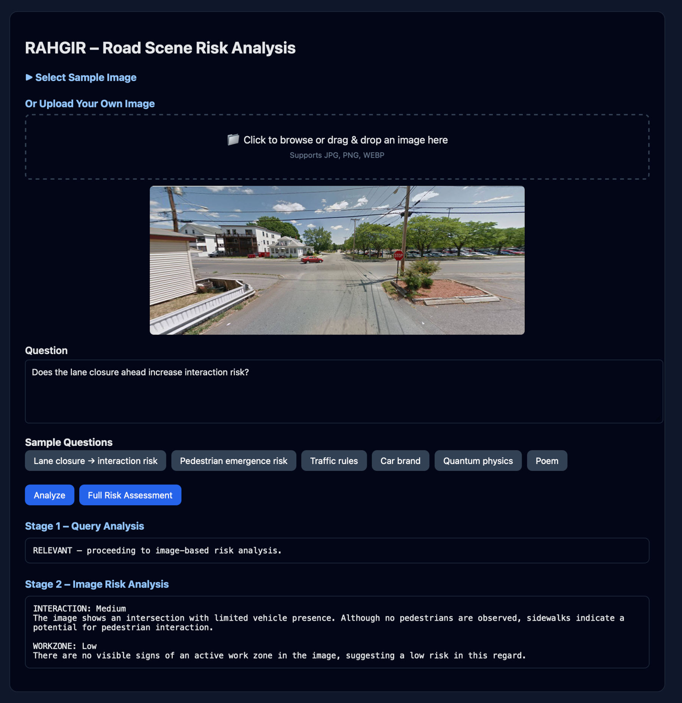
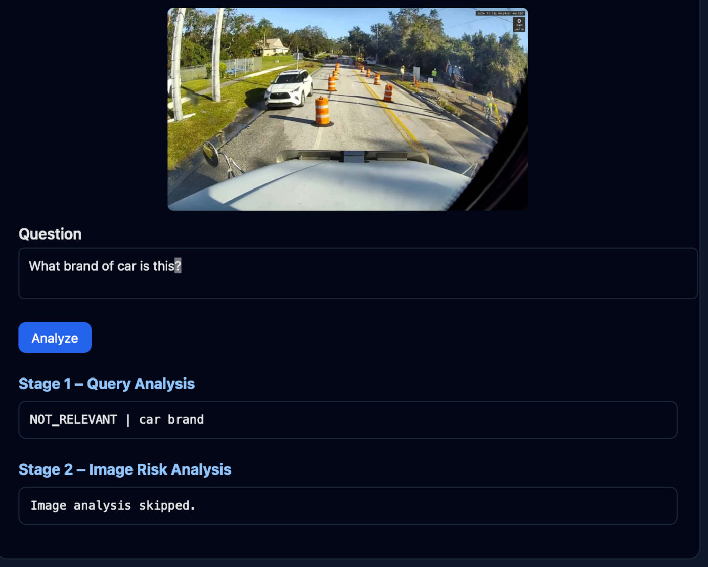
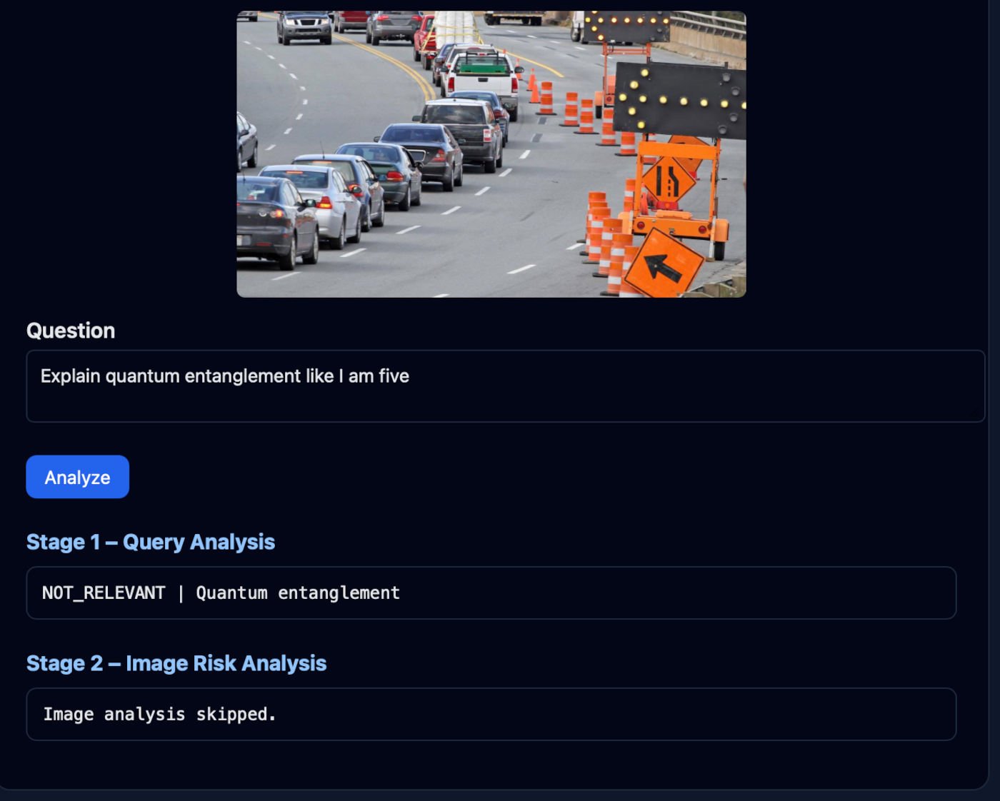
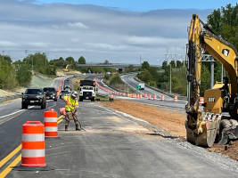
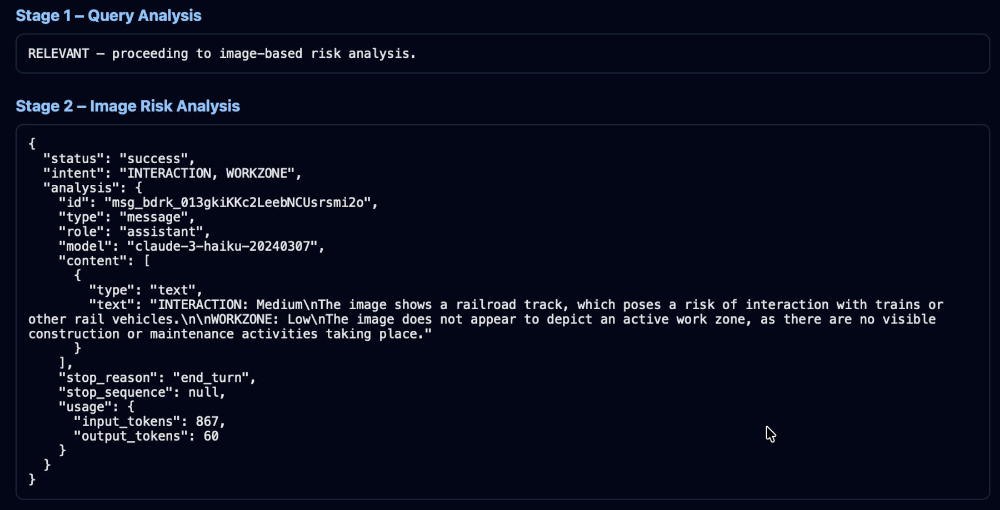
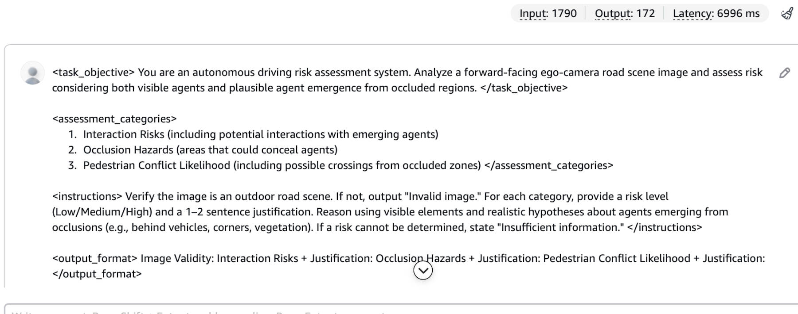
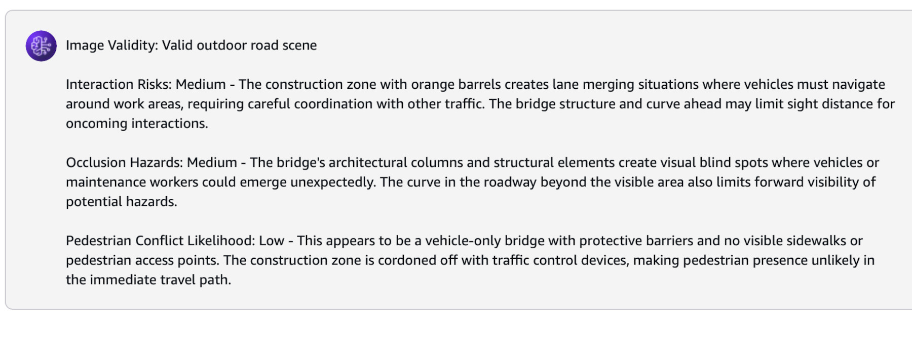

<h1>RAHGIR</h1>

<p><strong>Road-scene Analysis for Hazards with Grounded Interactive Risk Reasoning</strong></p>

<p>
RAHGIR is a policy-conditioned, domain-specialized vision–language reasoning system
designed to analyze forward-facing ego-vehicle road scenes and produce structured,
probabilistic assessments of traffic risk under partial observability.
</p>

<p align="center">
  
  <br>
  <em>RAHGIR web interface showing input image, text question, and VLM risk assessment result</em>
</p>

<h2>What RAHGIR Does</h2>
<ul>
  <li>Converts a single road image into explicit risk assessments</li>
  <li>Reasons from the ego-vehicle perspective using traffic-domain constraints</li>
  <li>Produces calibrated Low / Medium / High risk estimates with justifications</li>
</ul>

<h2>Key Capabilities</h2>
<ul>
  <li>Policy-conditioned hazard reasoning grounded in visual evidence</li>
  <li>Explicit modeling of interaction risk between traffic agents</li>
  <li>Occlusion-aware risk inference under incomplete observability</li>
  <li>Structured, evaluation-friendly outputs (not free-form captions)</li>
</ul>

<h2>Reasoning Modes</h2>
<ul>
  <li><strong>Observed-agent risk</strong>: Risk estimation conditioned on visible road users</li>
  <li><strong>Hypothetical-agent risk</strong>: Risk estimation under potential agent emergence from occluded regions</li>
</ul>

<p>
RAHGIR is implemented on AWS with explicit reasoning policies,
guardrails, calibration layers, and an evaluation harness.
  <!-- that mirrors a fine-tuned vision-language model pipeline—without model retraining. -->
</p>

<h2>Web Interface</h2>

<p>
The RAHGIR web interface provides an intuitive way to interact with the risk assessment system. Users can select from sample road scene images or upload their own images for analysis.
</p>

<p align="center">
  
  <br>
  <em>Input options: select sample images or upload custom images with drag-and-drop support</em>
</p>

<hr style="border: none; border-top: 2px solid #e5e7eb; margin: 30px 0;">

<h3>Two-Stage Query Processing</h3>

<p>
RAHGIR employs a cost-efficient two-stage architecture to handle user queries:
</p>

<ol>
  <li><strong>Stage 1 – Query Relevance Analysis</strong>: A lightweight text-only model determines if the query is relevant to road safety and risk assessment</li>
  <li><strong>Stage 2 – Vision-Language Risk Analysis</strong>: Only relevant queries proceed to the expensive VLM for image-based risk assessment</li>
</ol>

<p>
This approach prevents costly VLM calls for off-topic queries while maintaining fast response times for legitimate safety questions.
</p>

<h3>Query Filtering Examples</h3>

<p>
The system intelligently filters non-relevant queries before invoking the VLM:
</p>

<p align="center">
  
  <br>
  <em>Query: "What brand of car is this?" → Stage 1: NOT_RELEVANT | car brand → Stage 2: Image analysis skipped</em>
</p>

<p align="center">
  
  <br>
  <em>Query: "Explain quantum entanglement like I am five" → Stage 1: NOT_RELEVANT | Quantum entanglement → Stage 2: Image analysis skipped</em>
</p>

<p>
This pre-filtering is crucial because some queries may superficially appear related to transportation or safety but are actually off-topic. Since VLM queries are expensive, this cheap text-based pre-check significantly reduces operational costs while maintaining system responsiveness.
</p>

<hr style="border: none; border-top: 2px solid #e5e7eb; margin: 30px 0;">

<h3>Sample Risk Assessment Results</h3>

<p>
When relevant queries are submitted, RAHGIR provides detailed risk assessments. Here are examples demonstrating the system's contextual understanding:
</p>

<hr style="border: none; border-top: 2px solid #e5e7eb; margin: 30px 0;">

<h4>Example 1: Active Work Zone</h4>

<p align="center">
  
</p>

<p>
<strong>Image:</strong> Route-32 work zone<br>
<strong>Query:</strong> "Does the lane closure ahead increase interaction risk?"
</p>

```json
{
  "status": "success",
    "content": [
      {
        "type": "text",
        "text": "INTERACTION: Medium\nThe image shows a road construction zone with vehicles and workers present, which increases the risk of interaction between vehicles and workers.\n\nWORKZONE: High\nThe image depicts an active road construction site with heavy machinery, workers, and traffic control measures, indicating a high-risk work zone environment."
      }
    ],
    "stop_reason": "end_turn",
    "stop_sequence": null,
    "usage": {
      "input_tokens": 1619,
      "output_tokens": 67
    }
  }
```

<hr style="border: none; border-top: 2px solid #e5e7eb; margin: 30px 0;">

<h4>Example 2: Non-Road Scene (Basketball Court)</h4>

<p align="center">
  
</p>

<p>
<strong>Image:</strong> Basketball court<br>
<strong>Query:</strong> "Does the lane closure ahead increase interaction risk?"
</p>

```json
{
  "status": "success",
    "content": [
      {
        "type": "text",
        "text": "This image does not depict a road scene or any traffic-related risks. Instead, it shows a group of people playing basketball on an outdoor court. There are no obvious risks related to interaction or work zones in this image."
      }
    ],
    "stop_reason": "end_turn",
    "stop_sequence": null,
    "usage": {
      "input_tokens": 1302,
      "output_tokens": 49
    }
  }
```

<hr style="border: none; border-top: 2px solid #e5e7eb; margin: 30px 0;">

<h4>Example 3: Railroad Tracks</h4>

<p>
<strong>Image:</strong> Railroad tracks in Greenfield<br>
<strong>Query:</strong> "Does the lane closure ahead increase interaction risk?"
</p>

```json
{
  "status": "success",
  "intent": "INTERACTION, WORKZONE",
  "analysis": {
    "id": "msg_bdrk_013gkiKKc2LeebNCUsrsmi2o",
    "type": "message",
    "role": "assistant",
    "model": "claude-3-haiku-20240307",
    "content": [
      {
        "type": "text",
        "text": "INTERACTION: Medium\nThe image shows a railroad track, which poses a risk of interaction with trains or other rail vehicles.\n\nWORKZONE: Low\nThe image does not appear to depict an active work zone, as there are no visible construction or maintenance activities taking place."
      }
    ],
    "stop_reason": "end_turn",
    "stop_sequence": null,
    "usage": {
      "input_tokens": 867,
      "output_tokens": 60
    }
  }
}
```

<p align="center">
  
  <br>
  <em>VLM correctly identifies railroad interaction risk while noting absence of work zone activity</em>
</p>

<hr style="border: none; border-top: 2px solid #e5e7eb; margin: 30px 0;">

<h3>Testing on AWS Bedrock</h3>

<p>
RAHGIR can also be tested directly through the AWS Bedrock console for development and validation purposes:
</p>

<p align="center">
  
  <br>
  <em>Submitting a query with image through AWS Bedrock console</em>
</p>

<p align="center">
  
  <br>
  <em>VLM response showing structured risk assessment in Bedrock</em>
</p>

<hr style="border: none; border-top: 2px solid #e5e7eb; margin: 30px 0;">

<h3>Contextual Understanding</h3>

<p>
These examples demonstrate RAHGIR's ability to:
</p>

<ul>
  <li><strong>Recognize road-relevant scenes</strong>: Correctly identifies work zones with appropriate risk levels (Example 1)</li>
  <li><strong>Reject non-road scenes</strong>: Recognizes when an image doesn't depict a road environment (Example 2)</li>
  <li><strong>Adapt to transportation contexts</strong>: Understands railroad tracks as a transportation risk domain, even when the query mentions "lane closure" (Example 3)</li>
  <li><strong>Provide nuanced assessments</strong>: Distinguishes between interaction risks and work zone risks with separate justifications</li>
</ul>

<p>
The VLM's responses are found in the JSON structure at <code>["content"][0]["text"]</code>, providing structured risk assessments that can be easily parsed and integrated into downstream safety systems.
</p>

<hr style="border: none; border-top: 2px solid #e5e7eb; margin: 30px 0;">

<h2>AWS Guardrails</h2>

<p>
RAHGIR implements comprehensive AWS Bedrock Guardrails to ensure safe and appropriate system behavior:
</p>

<ul>
  <li><strong>Content filtering</strong>: Blocks toxic, harmful, or inappropriate text and image inputs</li>
  <li><strong>Input validation</strong>: Ensures queries and images meet safety and quality standards</li>
  <li><strong>Output moderation</strong>: Validates VLM responses before returning to users</li>
  <li><strong>Policy enforcement</strong>: Maintains domain-specific constraints on reasoning and outputs</li>
</ul>

<p>
These guardrails protect against misuse while ensuring the system remains focused on legitimate road safety assessment tasks.
</p>

<hr style="border: none; border-top: 2px solid #e5e7eb; margin: 30px 0;">

<h2>AWS Architecture</h2>

<p>
RAHGIR is deployed as a serverless application on AWS, leveraging multiple managed services for scalability, reliability, and cost-efficiency:
</p>

<h3>Core Services</h3>

<ul>
  <li><strong>Amazon Bedrock</strong>: Hosts the vision-language models (Claude 3 Haiku) for both query analysis and image-based risk assessment. Provides built-in guardrails for content filtering and safety.</li>
  
  <li><strong>AWS Lambda</strong>: Executes the two-stage analysis pipeline:
    <ul>
      <li>Stage 1: Text-only query relevance classification</li>
      <li>Stage 2: VLM-based image risk assessment (conditional on Stage 1)</li>
    </ul>
    Serverless architecture ensures automatic scaling and pay-per-use pricing.
  </li>
  
  <li><strong>Amazon API Gateway</strong>: Provides RESTful API endpoint (<code>https://xtamfymjx4.execute-api.us-east-1.amazonaws.com/analyze</code>) for client requests. Handles request validation, throttling, and CORS configuration.</li>
  
  <li><strong>Amazon S3</strong>: Hosts the static web interface (HTML/CSS/JavaScript) with public read access for the application frontend.</li>
  
  <li><strong>Amazon CloudFront</strong>: Content delivery network (CDN) that serves the S3-hosted web interface with:
    <ul>
      <li>Global edge locations for low-latency access</li>
      <li>HTTPS encryption</li>
      <li>Caching for improved performance</li>
      <li>Custom domain support (optional)</li>
    </ul>
  </li>
</ul>

<h3>Architecture Flow</h3>

<ol>
  <li>User accesses web interface via CloudFront URL</li>
  <li>CloudFront serves static assets from S3 bucket</li>
  <li>User submits query + image through web interface</li>
  <li>Browser sends POST request to API Gateway endpoint</li>
  <li>API Gateway triggers Lambda function</li>
  <li>Lambda executes Stage 1 (text analysis) via Bedrock</li>
  <li>If relevant, Lambda executes Stage 2 (VLM analysis) via Bedrock</li>
  <li>Lambda returns structured JSON response</li>
  <li>Web interface displays results to user</li>
</ol>

<h3>Benefits of This Architecture</h3>

<ul>
  <li><strong>Serverless</strong>: No infrastructure management, automatic scaling, pay-per-use pricing</li>
  <li><strong>Cost-efficient</strong>: Two-stage filtering prevents expensive VLM calls for irrelevant queries</li>
  <li><strong>Secure</strong>: Bedrock Guardrails, API Gateway throttling, CloudFront HTTPS</li>
  <li><strong>Scalable</strong>: Handles traffic spikes automatically without manual intervention</li>
  <li><strong>Global</strong>: CloudFront CDN provides low-latency access worldwide</li>
  <li><strong>Maintainable</strong>: Single-file HTML application, Lambda function updates without downtime</li>
</ul>
